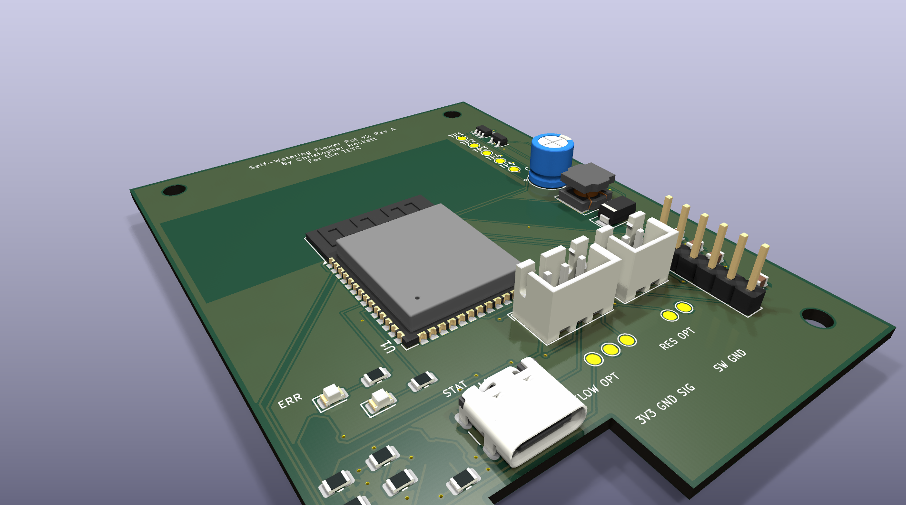

# Self-Watering Flower Pot V2

Custom ESP32-S3 controller hardware and bring-up firmware for a self-watering flower pot prototype.

This repository contains the KiCad design files, generated fabrication outputs, mechanical STEP exports, board renders, BOM notes, bring-up reports, and the first safe test firmware used on the assembled Board A prototype.



## Current Status

- Board A cost-down prototype has been fabricated and hand assembled for bring-up.
- USB-C power, 3.3 V regulator, ESP32-S3 native USB flashing, status LEDs, moisture ADC, and pump-gate bring-up checks have been tested.
- Current firmware is a supervised pump-test build with a hard 2 second maximum pump pulse.
- Board B UI daughterboard files remain in the repository as a deferred optional design.
- The cost-down Board A fabrication package is available in `fabrication/board_a_cost_down/`.

## Hardware Overview

Board A is the main controller board:

- ESP32-S3-WROOM-1-N8 module
- USB-C 5 V input
- AP63203 buck regulator for the 3.3 V logic rail
- Capacitive soil moisture sensor input on `J3`
- AO3400A low-side pump MOSFET footprint with gate resistor and pulldown
- SS34-style pump flyback diode
- Red error LED and green status LED
- Optional reservoir switch and flow pulse pads
- Debug/programming backup header `J7`
- Test points for rails and key signals

Board B is a deferred UI daughterboard concept with OLED/encoder support.

## Firmware

The current bring-up firmware lives in `firmware/testcode1/`.

It hosts a local Wi-Fi access point and web page:

- SSID: `FlowerPot-testcode1`
- Password: `flowerpot1`
- URL: `http://192.168.4.1`

The page shows moisture ADC readings, rolling average, min/max/span, rough wetness band, optional input short status, flow pulse count, Wi-Fi settings, LED test buttons, and a supervised pump test button.

Important safety rule: this is not autonomous watering firmware. The pump button requires a browser warning acknowledgement, and the firmware caps each pump run at 2000 ms.

## Repository Map

- `SmartWateringFlowerPot.kicad_pro`, `.kicad_sch`, `.kicad_pcb` - Board A KiCad project
- `board_b_ui/` - deferred UI board KiCad project
- `firmware/testcode1/` - PlatformIO bring-up firmware
- `docs/` - design notes, pinout, BOM notes, bring-up checklist, and hardening review
- `reports/` - saved ERC/DRC and audit reports
- `outputs/` - schematic PDFs, routing PDFs/SVGs, reference images, and 3D renders
- `fabrication/` - Gerbers, drill files, BOM CSVs, and fab zips
- `mechanical/` - STEP exports for enclosure/mechanical fit checks
- `CODEX_HANDOVER.md` - detailed project history and design context

## Bring-Up Notes

Before connecting a pump:

- Verify `+5V`, `+3V3`, and `GND`.
- Confirm there are no rail shorts.
- Confirm the ESP32 flashes over USB.
- Confirm `PUMP_GATE` remains LOW during boot/reset.
- Test the MOSFET gate with the pump disconnected.
- Use short, supervised pump tests only after the MOSFET and flyback diode are verified. Do not run the pump from a laptop USB port.

The moisture connector `J3` board order is:

```text
3V3  GND  SIG
```

The common capacitive sensor mapping is:

```text
VCC -> +3V3
GND -> GND
AOUT -> SIG
```

## Build Firmware

From `firmware/testcode1/`:

```powershell
python -m platformio run
python -m platformio run --target upload
```

The current `platformio.ini` targets the ESP32-S3 over `COM3`; change the port if your machine enumerates it differently.

## KiCad Checks

KiCad 9 is expected. If `kicad-cli` is on your PATH:

```powershell
kicad-cli sch erc --format report --output reports/erc.txt SmartWateringFlowerPot.kicad_sch
kicad-cli pcb drc --format report --output reports/drc.txt SmartWateringFlowerPot.kicad_pcb
```

KiCad GUI remains the source of truth for visual PCB edits.

## License

This project is released under the MIT License. See `LICENSE`.
